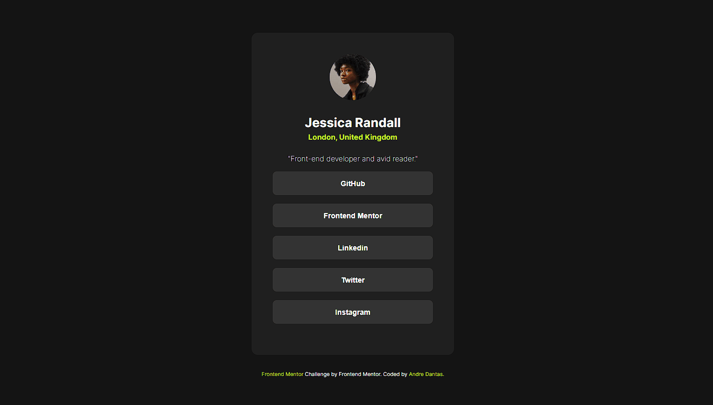

# Frontend Mentor - Social links profile solution

Esta é uma solução para o [Social links profile challenge on Frontend Mentor](https://www.frontendmentor.io/challenges/social-links-profile-UG32l9m6dQ). 

## Table of contents - Índice

- [Overview](#overview)
  - [O Desafio](#O-Desafio)
  - [Screenshot](#screenshot)
  - [Links](#links)
- [My process](#my-process)
  - [Construído com](#Construído-Com)
  - [O que Aprendi](#what-i-learned)
  - [Continued development](#continued-development)
  - [Useful resources](#useful-resources)
- [Author](#author)

## Overview

### The challenge

Os usuários devem ser capazes de:

Ver e explorar um Cartão de Redes Sociais do Perfil de um usuário, onde cada botão listado corresponde a uma rede social. 
Neste desafio somente com HTML e CSS é um projeto perfeito para iniciantes que querem se familiarizar com os fundamentos de HTML e CSS, como a estrutura HTML e o modelo de caixa(Flexbox).

### Screenshot

### Links

- Solution URL: [Add solution URL here](https://your-solution-url.com)

## My process

### Built with

- Semantic HTML5 markup
- CSS custom properties
- Flexbox
- CSS Grid - Autofill
- Media Querye

### O que Aprendi

- Nesse projeto comecei utilizando apenas display flex para organizar o visual da página, criamos basicamente quatro divs semanticas para separar as area de edição header, nav e footer, tudo dentro do container(main). Utilizamos lista não ordenada para os botões, além da tag de button. 

### Desenvolvimento Contínuo

Desejo continuar melhorar na questão de espaçamentos do CSS, melhorar e estudar mais sobre display flex e display Grid.
Continuar e melhorar na questão de responsividade, deixando os projetos com maior compatibilidade em diversos dispositivos.

## Author

- Website - [Andre Dantas](https://github.com/andredantasti)
- Frontend Mentor - [@andredantasti](https://www.frontendmentor.io/profile/andredantasti)
- Instagram - [@andredantasti](https://www.instagram.com/andredantasti)

